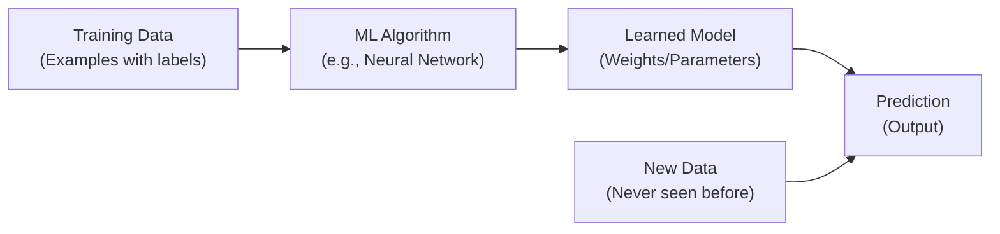
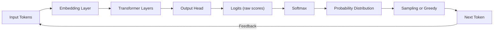
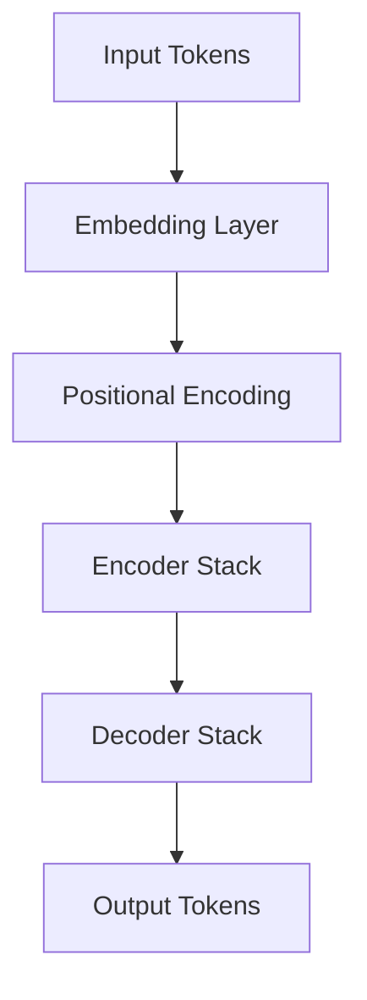
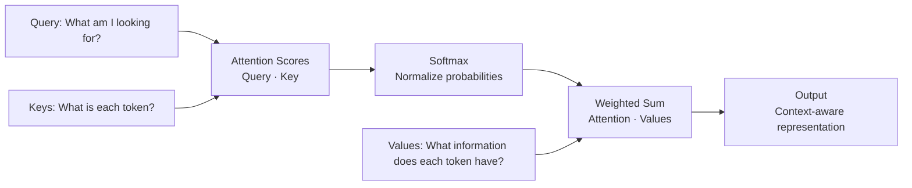
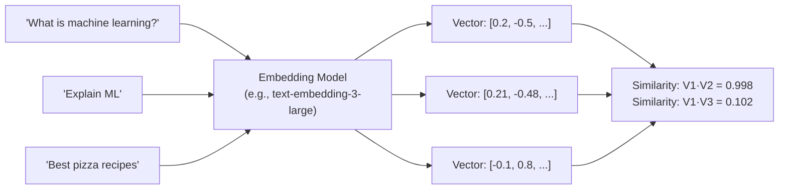
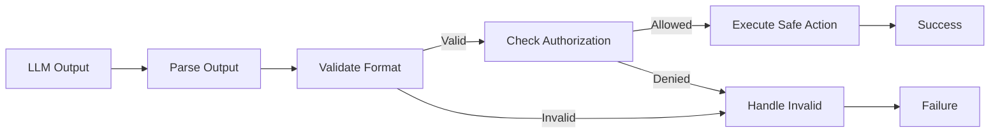

# Chapter 1: Introduction to Generative AI Foundations

## Chapter Overview

Generative AI represents a fundamental paradigm shift in how computing systems process information, make decisions, and create novel content. Unlike traditional software systems built on explicit business logic and deterministic algorithms, generative AI systems leverage large-scale neural networks trained on massive datasets to synthesize text, code, images, and structured information.

This chapter establishes the conceptual and technical foundation necessary to understand agentic AI systems. It is not intended as an introductory tutorial for beginners, but rather as a rigorous technical foundation for architects and senior engineers designing enterprise-grade AI systems.

**Core thesis**: Understanding the capabilities, limitations, and failure modes of generative AI models is essential prerequisite knowledge for building reliable agentic systems. Many architectural failures in production AI systems stem not from poor orchestration or governance, but from fundamental misunderstandings of what LLMs can and cannot do.

---

## Learning Objectives

After reading this chapter, you will:

1. **Understand the historical evolution** of AI from rule-based systems through foundation models, and recognize why generative AI represents a fundamental departure from traditional machine learning
2. **Grasp LLM fundamentals**: what LLMs are, how they work, and the distinction between understanding and statistical pattern matching
3. **Explain transformer architecture** at a technical level sufficient to reason about context, attention mechanisms, and scaling implications
4. **Reason about tokenization**, context windows, and their impact on RAG architecture and prompt engineering
5. **Distinguish between deterministic and probabilistic systems** and when to use each in production architectures
6. **Evaluate reasoning models** and understand their role in agentic systems
7. **Architect retrieval and grounding strategies** based on LLM limitations
8. **Identify common architectural mistakes** when treating LLMs as databases, knowledge stores, or decision-making systems

---

## Prerequisites

- Basic familiarity with neural networks and deep learning concepts (not required but helpful)
- Experience building traditional software systems
- Understanding of production systems engineering principles

---

## 1. Evolution of AI: From Rules to Foundation Models

Understanding where generative AI came from provides crucial context for understanding its strengths and limitations.

### Era 1: Rule-Based Systems (1960s–1980s)

**Concept**: Explicit rules encode domain knowledge.

```
IF condition THEN action
```

**Examples**:
- Expert systems for medical diagnosis
- Decision trees for credit scoring
- Finite state machines for workflow automation

**Characteristics**:
- Fully deterministic
- Completely interpretable (you can trace every decision)
- Limited to domains where rules can be enumerated
- Brittle (any rule not anticipated fails)
- Requires human experts to encode knowledge

**Failure mode**: Systems fail catastrophically when encountering situations outside their programmed rules.

### Era 2: Statistical Machine Learning (1990s–2010s)

**Concept**: Learn patterns from data rather than encoding rules manually.

```
Data → Features → Model → Prediction
```

**Examples**:
- Logistic regression
- Random forests
- Support vector machines
- Naive Bayes classifiers

**Characteristics**:
- Data-driven rather than rule-driven
- Generalizes to new data the model hasn't seen
- Still relatively interpretable (feature importance, coefficients)
- Requires feature engineering
- Performs well on narrow domains

**Failure mode**: Models memorize training data (overfitting) or miss important patterns they weren't trained on.

### Era 3: Deep Learning (2012–2019)

**Concept**: Stack many neural network layers to learn hierarchical representations.

```
Raw Input → Layer 1 → Layer 2 → ... → Layer N → Output
```

**Key advances**:
- CNNs (Convolutional Neural Networks) for computer vision
- RNNs/LSTMs for sequences
- Attention mechanisms for handling variable-length dependencies

**Characteristics**:
- Minimal feature engineering required (learns features automatically)
- Dramatically better performance on complex tasks (vision, speech)
- Requires enormous amounts of data and compute
- Black box (impossible to explain individual predictions)

**Example**: ImageNet breakthrough (2012) showed deep learning could solve problems that ruled approaches couldn't handle.

**Failure mode**: Adversarial examples—tiny perturbations to input that cause confident wrong predictions.

### Era 4: Foundation Models (2020–2023)

**Concept**: Train one massive model on enormous unlabeled datasets. Fine-tune or prompt for specific tasks.

```
Internet-Scale Data → 
    Transformer → 
        Foundation Model → 
            Task-Specific Adaptation
```

**Key examples**:
- **GPT series** (OpenAI): Auto-regressive language models, 175B to 1.3T parameters
- **Claude series** (Anthropic): Constitutional AI-trained models, focus on reasoning and safety
- **Gemini** (Google): Multimodal model trained on diverse data
- **Llama** (Meta): Open-source foundational model
- **Mistral** (Mistral AI): Efficient open model

**Characteristics**:
- Trained on petabytes of unstructured text/code
- Generalize across vastly different domains without retraining
- Demonstrate "emergent" capabilities not explicitly trained
- Extremely capable but unpredictable failure modes
- Require billions/trillions of tokens to train effectively

**Key insight**: Foundation models are NOT databases or knowledge stores. They are **probabilistic token prediction machines** that generate likely continuations based on training and context.

### Era 5: Agentic Systems (2023–Present)

**Concept**: Foundation models become components within systems that reason, plan, act, and learn.

```
Foundation Model + 
    Memory + 
    Planning + 
    Tool Access + 
    Feedback Loop → 
        Agentic System
```

**Key characteristics**:
- Models are no longer end products but infrastructure components
- Systems maintain state across multiple steps
- Agents retrieve information, decide on actions, use tools
- Humans provide oversight and correction
- Multiple specialized agents coordinate toward shared goals

**Implication for architecture**: Agentic systems are fundamentally different from traditional software. They combine probabilistic reasoning (LLMs) with deterministic execution (tools, databases, APIs), mediated by governance layers.

---

## 2. Core Concepts

### 2.1 What Is an AI System?

**Definition**: An AI system is software that:
- Takes unstructured input (text, images, data)
- Applies learned patterns or rules to process that input
- Produces output (predictions, decisions, generated content)

**Distinction from traditional software**:

| Aspect | Traditional Software | AI System |
|--------|---|---|
| Logic | Explicitly programmed | Learned from data |
| Failure mode | Crashes or incorrect logic | Incorrect/hallucinated output |
| Explainability | Fully traceable | Opaque ("black box") |
| Scalability | Linear (add more servers) | Nonlinear (more data, different behavior) |
| Testing | Deterministic (same input → same output) | Probabilistic (same input → potentially different output) |
| Debugging | Inspect code and state | Inspect training data and model weights |

### 2.2 What Is Machine Learning?

**Definition**: Machine learning is the field of developing systems that learn patterns from data rather than being explicitly programmed.

**Core workflow**:



**Key insight**: The model never memorizes the training data. It learns patterns that generalize to new data.

### 2.3 What Is Deep Learning?

**Definition**: Deep learning uses neural networks with multiple layers to learn hierarchical representations of data.

**Example: Image Recognition**:
- Layer 1: Learns edges
- Layer 2: Learns textures
- Layer 3: Learns shapes
- Layer 4: Learns objects
- Layer 5: Recognizes "cat"

**Why deep learning works**: Early layers learn low-level features; later layers combine them into high-level concepts.

### 2.4 What Are Foundation Models?

**Definition**: Foundation models are large neural networks trained on massive, diverse datasets that can be adapted to many downstream tasks.

**Characteristics**:

| Characteristic | Detail |
|---|---|
| Scale | 7B to 1.3T+ parameters |
| Training data | Internet-scale text, code, images, structured data |
| Training time | Weeks to months on specialized hardware |
| Training cost | $100K to $100M+ for largest models |
| Generalization | Works across languages, domains, tasks |
| Emergent abilities | Capabilities not explicitly trained (reasoning, coding, translation) |

**Why foundation models are revolutionary**:
- **Before**: Train separate model for each task (spam detection, sentiment analysis, translation)
- **After**: Train one model, adapt it to thousands of tasks with prompt engineering

### 2.5 What Are Large Language Models (LLMs)?

**Definition**: LLMs are foundation models specialized in natural language processing. They predict the next token (word/subword) based on previous tokens.

**Capability spectrum**:

| Task | Capability | Reliability |
|------|---|---|
| Text summarization | Excellent | High |
| Fact retrieval | Good | Moderate |
| Question answering | Good | Moderate |
| Creative writing | Excellent | High |
| Mathematical reasoning | Moderate | Low |
| Code generation | Good | Moderate |
| Understanding context | Excellent | High |
| Long-term consistency | Poor | Low |

---

## 3. LLM Fundamentals: What LLMs Actually Are

This section addresses persistent misconceptions about LLMs.

### 3.1 Core Truth: LLMs Are Token Prediction Machines

**What an LLM does**:

```
Input tokens → Neural network → Probability distribution → Sample token
```

**Example**:

```
Input:  "The capital of France is"
LLM processes: [The=1, capital=2, of=3, France=4, is=5]
Output: Distribution over vocabulary
        Paris: 0.98
        London: 0.01
        France: 0.005
        ...
Sampled token: "Paris"
```

**Critical distinction**: The LLM is NOT looking up facts in a knowledge base. It is computing a probability distribution over possible next tokens based on patterns in training data.

### 3.2 What LLMs Are NOT

**Common misconception #1: "LLMs understand language"**

**Reality**: LLMs model statistical patterns in language. They don't understand meaning the way humans do. They recognize that certain token sequences frequently co-occur.

Example of what this means:
```
Input: "In mathematics, π (pi) equals approximately"
LLM outputs: "3.14159..." (because this sequence appeared often in training data)

Input: "In the movie, the hero's name is π"
LLM might output: "Smith" (completing a plausible pattern)

It doesn't actually know what π means. It knows the patterns.
```

**Common misconception #2: "LLMs have knowledge"**

**Reality**: LLMs have compressed patterns from training data. They cannot reliably retrieve facts, dates, or names.

```
Question: "Who won the 2024 Nobel Prize in Physics?"
LLM: "I don't have data beyond April 2024"
(because its training was cut off, not because it "knows" it doesn't know)
```

**Common misconception #3: "LLMs are databases"**

**Reality**: LLMs hallucinate (invent plausible-sounding but false information) frequently. They are not reliable for fact retrieval.

```
Prompt: "List all companies founded by Steve Jobs"
LLM might output: "Apple, Pixar, Next" (correct)
Or: "Apple, Pixar, Oracle, Xerox" (hallucinated—wrong)

The LLM doesn't know it's wrong. It generates statistically likely text.
```

### 3.3 How LLMs Generate Output

**Process**:



**Temperature parameter** controls randomness:
- Temperature = 0: Always pick the highest probability token (deterministic)
- Temperature = 1.0: Sample from full distribution (diverse)
- Temperature = 2.0: Maximum randomness

**Top-K sampling**: Only consider K most likely tokens (reduces nonsense)

**Top-P sampling**: Only consider tokens until cumulative probability reaches P (adaptive)

### 3.4 Context Windows and Their Implications

**Definition**: The context window is the maximum number of tokens the model can process at once.

**Examples**:
- GPT-3.5: 4K tokens (~3,000 words)
- GPT-4: 8K or 128K tokens (~6,000 or 100,000 words)
- Claude 3: 100K to 200K tokens (~75,000 to 150,000 words)

**Critical misconception**: "Large context windows eliminate the need for RAG"

**Reality**: Larger contexts create new problems:

| Problem | Impact |
|---------|--------|
| Cost scaling | Costs scale linearly with context. A 200K context is 25× more expensive than 8K |
| Latency | Longer inputs increase processing time |
| "Lost in the middle" | Models perform worse at finding information in the middle of large contexts |
| Noise amplification | More irrelevant information = harder to find signal |
| Attention dilution | Attention mechanisms struggle to focus on relevant information in vast contexts |

**Production lesson**: Even with 200K context, retrieval-augmented generation is essential. RAG provides **precision** and **cost efficiency** that large contexts alone cannot achieve.

---

## 4. Transformer Architecture: The Foundation of Modern AI

### 4.1 Why Transformers Matter

Before transformers (2017), sequence processing relied on RNNs (Recurrent Neural Networks):
- Processed tokens one at a time
- Slow to train (couldn't parallelize)
- Struggled with long sequences (gradients vanished)

**Transformers changed everything**:
- Process all tokens in parallel
- 100× faster training
- Handle longer sequences
- Enable scaling to billions of parameters

### 4.2 Transformer Components

A transformer consists of:



**Embedding Layer**: Converts tokens (integers) to dense vectors.
```
Token 42 → [0.123, -0.414, 0.789, ..., 0.012]  (768-dim vector)
```

**Positional Encoding**: Adds information about token positions.
```
Token 1: [0.123, -0.414, 0.789, ...] + [sin(0), cos(0), ...]
Token 2: [0.456, 0.789, -0.123, ...] + [sin(2π/10000), cos(2π/10000), ...]
```

This allows the model to know order (important for language understanding).

**Encoder/Decoder Blocks**: Stacked layers that process and transform representations.

### 4.3 Self-Attention: The Key Mechanism

**Core idea**: Each token attends to all other tokens to understand context.

**Example**:
```
Sentence: "The cat sat on the mat because it was comfortable."

When processing "it", self-attention computes:
- Relevance to "cat" (high): 0.7
- Relevance to "mat" (medium): 0.2
- Relevance to "comfortable" (medium): 0.1

So "it" learns a weighted combination of representations from these words.
```

**Mechanism**:



**Why this matters**:
- Enables models to understand relationships between distant words
- Allows parallelization (all tokens process simultaneously)
- Scales to very long sequences

**Attention formula** (simplified):
```
Attention(Q, K, V) = softmax(Q·K^T / √d_k)·V
```

Where:
- Q (Query): What we're looking for
- K (Key): Tags for each value
- V (Value): The actual information
- √d_k: Scaling factor to keep gradients stable

### 4.4 Stacking Layers

Modern LLMs stack 40-96 transformer layers. Each layer:
- Refines understanding
- Builds hierarchical representations
- Enables increasingly abstract reasoning

**Intuition**:
- Early layers: Simple patterns (tokens, syntax)
- Middle layers: Semantic meaning, relationships
- Late layers: High-level concepts, reasoning

---

## 5. Tokenization: How Text Becomes Numbers

### 5.1 Why Tokenization Matters

LLMs only understand numbers. Text must be converted to numbers (tokens) before processing.

**Definition**: Tokenization is splitting text into chunks (tokens) and assigning each a unique ID.

### 5.2 Tokenization Methods

**Character-level tokenization**:
```
Input:  "Hello"
Tokens: ['H', 'e', 'l', 'l', 'o']
IDs:    [8, 5, 12, 12, 15]
Pros:   Small vocabulary, handles any text
Cons:   Long sequences, hard to learn patterns
```

**Word-level tokenization**:
```
Input:  "Hello world"
Tokens: ['Hello', 'world']
IDs:    [1001, 1002]
Pros:   Shorter sequences, preserves meaning
Cons:   Huge vocabulary, struggles with rare words
```

**Subword tokenization (BPE, SentencePiece)**:
```
Input:  "unbelievable"
Tokens: ['un', 'believe', 'able']
IDs:    [234, 567, 890]
Pros:   Handles rare words, reasonable vocabulary size
Cons:   Requires learned vocabulary
```

### 5.3 Token Count and Its Implications

**Architectural reality**: Token count directly drives:

| Factor | Impact |
|--------|--------|
| Cost | Per-token pricing; 2× tokens = 2× cost |
| Latency | Longer sequences take longer to process |
| Context efficiency | Every token uses part of your context window |
| Precision | More tokens = harder to find relevant information |

**Example**: A 500-page document:
- ~500 pages × 300 words/page × 1.3 tokens/word ≈ 195,000 tokens
- GPT-4 8K context can't fit even half the document
- Cost: 195,000 tokens × $0.03/1K tokens ≈ $5.85 per document

**Production lesson**: Never assume you can throw raw documents at an LLM. Chunking, summarization, and retrieval are non-negotiable.

### 5.4 Tokenization Challenges in Production

**Challenge 1: Tokenization varies by model**
```
Same text, different tokenizers:
Model A: 100 tokens
Model B: 120 tokens
```

Implication: Cost and latency predictions depend on specific model.

**Challenge 2: Special tokens**
```
<|endoftext|>: Marks end of sequence
<|start_of_system|>: System message delimiter
[CLS]: Classification token
```

These reserve tokens and reduce usable vocabulary.

**Challenge 3: Subword fragments lose meaning**
```
"Strawberry" might tokenize as:
["Straw", "berry"]

Model must learn to interpret fragments, not full words.
```

---

## 6. Embeddings and Semantic Search

### 6.1 What Are Embeddings?

**Definition**: An embedding is a numerical vector representation of text that captures semantic meaning.

**Example**:
```
"King" →    [0.2, -0.5, 0.8, ..., 0.1]   (1536 dimensions)
"Queen" →   [0.3, -0.4, 0.7, ..., 0.2]
"Pawn" →    [0.1, 0.2, -0.3, ..., -0.1]
```

### 6.2 How Embeddings Work

**Process**:



**Key insight**: Similar text → similar vectors. This enables semantic search.

### 6.3 Similarity Metrics

**Cosine Similarity**: Most common
```
similarity = (A · B) / (||A|| × ||B||)
Range: -1 to 1
- 1.0 = identical direction (semantically same)
- 0.0 = orthogonal (unrelated)
- -1.0 = opposite direction
```

**Euclidean Distance**: Geometric distance
```
distance = √(Σ(A_i - B_i)²)
Smaller = more similar
```

**Dot Product**: Raw score (used with normalized vectors)
```
score = A · B
Higher = more similar
```

### 6.4 Embedding Models

**Popular models**:

| Model | Dimensions | Training | Speed | Cost |
|---|---|---|---|---|
| text-embedding-3-small | 512 | Contrastive learning | Fast | $0.02/1M |
| text-embedding-3-large | 3072 | Contrastive learning | Moderate | $0.13/1M |
| bge-large-en-v1.5 | 1024 | Open source | Fast | Free |
| cohere-embed-english-v3 | 1024 | Proprietary | Fast | $0.10/1M |

### 6.5 Why Embeddings Matter for RAG

**Challenge**: How do you find relevant documents quickly from millions?

**Solution**: Embeddings enable semantic search
```
Query:     "How do I deploy to AWS?"
Query embedding: [0.2, -0.5, 0.8, ...]

Search in embedding database for documents with similar vectors
→ Find deployment guides (semantically similar)
→ NOT just keyword matches
```

---

## 7. Context Windows: Opportunity and Constraint

### 7.1 Context Window Sizes Over Time

```
GPT-2 (2019):      1K tokens
GPT-3 (2020):      4K tokens
GPT-3.5 (2022):    4K → 16K
GPT-4 (2023):      8K → 32K → 128K
Claude 3 (2024):   100K → 200K
Llama 3.1 (2024):  128K
Mixtral (2024):    32K
```

**Implication**: Context has grown 200× in 5 years.

### 7.2 The Context Window Misconception

**Common belief**: "With 200K context, we don't need RAG"

**Reality**: This is architecturally unsound.

**Why**:

1. **Cost scaling is linear**
   ```
   Query 8K:   $0.03 × 8 / 1000 = $0.00024
   Query 200K: $0.03 × 200 / 1000 = $0.006
   25× more expensive
   ```

2. **"Lost in the middle" problem**: Models perform worse finding information in the middle of large contexts
   ```
   Recall when relevant info is at:
   - Position 0-10%:   95% recall
   - Position 45-55%:  62% recall  ← Lost in middle!
   - Position 90-100%: 88% recall
   ```

3. **Attention dilution**: More tokens = harder to focus
   ```
   With 8K context:   Attention per relevant info: 100%
   With 200K context: Attention per relevant info: 4%
   ```

4. **Latency increases**
   ```
   8K:   ~500ms latency
   200K: ~5000ms latency
   ```

### 7.3 Optimal Use of Context

**Rule of thumb**:
- Context window: Amount of information visible at once
- RAG: Amount of information to retrieve

**Decision matrix**:

| Scenario | Strategy |
|----------|----------|
| Small document (< 5K tokens) | Fit in context directly |
| Medium document (5K–50K tokens) | Use RAG with retrieval |
| Large document (> 50K tokens) | Use RAG with chunking |
| Multiple documents | Use RAG with aggregation |
| Real-time updates | Use RAG with refresh strategy |

---

## 8. Reasoning Models and Advanced Reasoning

### 8.1 Traditional vs Reasoning Models

**Traditional models** (GPT-4, Claude 3.5):
```
Input → Process → Output
(Fast: <5 seconds)
```

**Reasoning models** (o1, similar approaches):
```
Input → Extended thinking → Reasoning chain → Verification → Output
(Slow: 10–120 seconds)
```

### 8.2 When Reasoning Models Outperform

**Domains where reasoning helps**:

| Domain | Benefit | Example |
|--------|---------|---------|
| Mathematics | Explicit steps | Calculus problems, proofs |
| Physics | Physical reasoning | Mechanics, thermodynamics |
| Code generation | Algorithm verification | Complex algorithms |
| Logic puzzles | Systematic exploration | Constraint satisfaction |
| Science | Causal reasoning | Experimental design |

**Domains where reasoning doesn't help much**:

| Domain | Why | Example |
|--------|-----|---------|
| Facts recall | No reasoning needed | "Who was president in 1950?" |
| Creative writing | Quality ≠ thinking time | Poetry, stories |
| Customer service | Quick decisions needed | Routing, FAQ |
| Summarization | Information retrieval | Extracting key points |

### 8.3 Cost and Latency Trade-off

**For cost-sensitive applications**:
- Use fast model (GPT-4, Claude 3.5)
- Cache reasoning externally (pre-compute hard problems)
- Use reasoning selectively

**For accuracy-critical applications**:
- Use reasoning model for verification
- Pipeline: Fast model → Check with reasoning model

---

## 9. Architecture Perspective: Where LLMs Fit

### 9.1 LLMs as Components, Not Solutions

**Incorrect mental model**:
```
User Input → LLM → Response
```

**Correct mental model**:
```
User Input
    ↓
[Validation Layer] ← Deterministic
    ↓
[Retrieval Layer] ← Deterministic + Search
    ↓
[LLM Layer] ← Probabilistic
    ↓
[Validation Layer] ← Deterministic
    ↓
[Guardrails Layer] ← Deterministic
    ↓
Response
```

### 9.2 Separation of Concerns

**Key principle**: Separate reasoning from execution

| Component | Type | Responsibility |
|-----------|------|---|
| Knowledge layer | Deterministic | Stores facts (DB, vector store) |
| Reasoning layer | Probabilistic | LLM reasoning and planning |
| Execution layer | Deterministic | Tools, APIs, actual actions |
| Governance layer | Deterministic | Permissions, policies, guardrails |

### 9.3 Production Reality

**Golden rule**: Every LLM output must be validated before use.



---

## 10. Common Mistakes in Generative AI Architecture

### Mistake 1: Treating LLMs as Databases

**Wrong approach**:
```
"Store all knowledge in prompts"
Result: $5000+ monthly cost, hallucinations, outdated information
```

**Correct approach**:
```
Knowledge → Database
Database → Retrieved selectively
Retrieved context → LLM reasoning
```

### Mistake 2: Assuming Larger Models Solve Architecture Problems

**Common belief**: "We'll upgrade to GPT-5 and everything will work"

**Reality**: Architecture matters more than model size
- Small model + good architecture > Large model + bad architecture
- Example: RAG systems with GPT-3.5 often outperform large models without retrieval

### Mistake 3: Ignoring Evaluation

**Without evaluation**:
- Hallucinations invisible
- Quality degradation undetected
- Drift unnoticed
- ROI unmeasurable

**With evaluation**:
- Track metrics (recall, precision, faithfulness)
- Catch regressions
- Optimize strategically
- Prove business value

### Mistake 4: No Guardrails or Validation

**Dangerous pattern**:
```python
# WRONG
response = llm.complete(user_prompt)
execute_command(response)  # Direct execution!
```

**Safe pattern**:
```python
# RIGHT
response = llm.complete(user_prompt)
parsed = parser.parse(response)        # Validate format
authorized = check_permissions(parsed) # Check access
if authorized:
    execute_command(parsed)            # Safe execution
```

### Mistake 5: Not Separating Reasoning from Action

**Anti-pattern**: LLM both reasons AND executes
```
LLM decides AND immediately acts
↓
No audit trail
No human oversight
No recovery from mistakes
```

**Better pattern**:
```
LLM reasons and proposes
Human (or policy engine) approves
Deterministic system executes
System logs everything
```

---

## 11. Trade-offs and Design Decisions

### 11.1 Speed vs Quality Trade-off

| Decision | Speed | Quality |
|----------|-------|---------|
| Fast model (GPT-3.5) | ✅ | ⚠️ |
| Large model (GPT-4) | ⚠️ | ✅ |
| Reasoning model (o1) | ❌ | ✅✅ |
| Smaller cached model | ✅✅ | ⚠️ |

**Recommendation**: Use fast model by default. Cache expensive inferences.

### 11.2 Cost vs Capability Trade-off

```
Monthly cost: 
$100  ← Open-source model
$500  ← Small commercial model
$5,000 ← Medium model at scale
$50,000 ← Large model at scale
```

**Strategy**:
- Use cheapest suitable model
- Optimize prompts to reduce tokens
- Cache common queries
- Use smaller models for simple tasks

### 11.3 Context Window vs Retrieval Trade-off

| Approach | Cost | Latency | Accuracy |
|----------|------|---------|----------|
| Everything in context | High | High | Moderate |
| Smart retrieval | Low | Low | High |
| No retrieval | Low | Low | Low |

**Recommendation**: Smart retrieval (RAG) for production systems.

---

## 12. Interview Questions

### Question 1: What is the difference between AI, ML, Deep Learning, and Generative AI?

**Expected answer structure**:
- AI: Broad field of systems exhibiting intelligent behavior
- ML: Systems that learn patterns from data
- Deep Learning: ML using neural networks with multiple layers
- Generative AI: Foundation models that generate novel content

**Example answer**:
"AI is the umbrella. Machine Learning is learning from data instead of programming rules. Deep Learning uses neural networks with many layers, enabling AI to work on complex unstructured data like images and text. Generative AI specifically refers to models trained on massive datasets that can generate new content. Each is more specialized than the previous."

**Red flags**:
- "They're all basically the same thing"
- Confusing ML with AI
- Not mentioning the pattern-learning aspect
- Missing the scale and data aspects of generative AI

**Follow-up**:
- "What changed between Deep Learning era and Generative AI era?"
- "Why is scale important in generative AI?"

---

### Question 2: What is a Large Language Model actually doing when it generates text?

**Expected answer structure**:
- LLMs predict the next token
- Based on previous tokens and patterns in training data
- Sample from probability distribution
- Iterate to build full response

**Example answer**:
"LLMs are fundamentally token prediction machines. Given a sequence of tokens, they compute a probability distribution over the next token, then sample from that distribution. They don't 'understand' or 'know' anything—they're computing statistically likely continuations. This is why they can hallucinate: they generate tokens that are statistically common, even if false."

**Red flags**:
- "LLMs retrieve from internal knowledge"
- "LLMs understand the meaning"
- "LLMs are databases"
- Missing the statistical/probabilistic aspect

**Follow-up**:
- "Given this, how should you design systems to prevent hallucinations?"
- "How does temperature affect this process?"

---

### Question 3: Why don't large context windows eliminate the need for RAG?

**Expected answer structure**:
- Cost scaling (linear with context)
- Lost in the middle problem
- Attention dilution
- Latency increases
- Precision over recall

**Example answer**:
"Even with 200K context, RAG is necessary. First, costs scale linearly—200K context is 25× more expensive than 8K, which makes it infeasible for many applications. Second, models exhibit the 'lost in the middle' problem: they're worse at finding information in the middle of large contexts. Third, attention becomes diluted across more tokens, making it harder to focus on relevant information. Finally, RAG provides precision—retrieving only relevant documents keeps the model focused."

**Red flags**:
- "Large context eliminates RAG"
- "It's just more expensive"
- Missing the "lost in the middle" phenomenon
- Not discussing precision vs recall

**Follow-up**:
- "When WOULD you put everything in context?"
- "How would you measure whether RAG is working?"

---

### Question 4: What's the architectural difference between treating LLMs as solutions vs components?

**Expected answer structure**:
- Solution: Direct input → LLM → Response
- Component: Layered (knowledge, reasoning, execution, governance)
- Component approach is production-safe
- Reasoning → Validation → Execution separation

**Example answer**:
"Treating LLMs as solutions means sending user input directly to the model and acting on the response—this fails in production. Treating them as components means LLMs are one part of a larger system. The correct pattern is: validate input → retrieve relevant knowledge → LLM reasons → validate output → check authorization → execute action. This adds friction but provides auditability, error handling, and safety."

**Red flags**:
- Suggesting direct LLM execution in production
- Not mentioning validation layers
- Missing governance/authorization layer
- Over-trusting LLM outputs

**Follow-up**:
- "Walk me through a production incident this prevents"
- "How does this relate to multi-agent systems?"

---

### Question 5: How would you explain the distinction between deterministic and probabilistic systems in the context of agentic AI?

**Expected answer structure**:
- Deterministic: Same input → Same output (DBs, APIs, logic)
- Probabilistic: Same input → Different output (LLMs, sampling)
- Production systems need both
- Governance must be deterministic

**Example answer**:
"In agentic systems, deterministic components include databases, APIs, authentication, and policy engines. They're reliable and auditable. Probabilistic components are LLMs that generate different outputs from the same input. Production systems carefully combine both: use deterministic systems for knowledge storage and enforcement, use LLMs for reasoning, then validate with deterministic checks before executing deterministic actions. This gives you the flexibility of AI with the reliability of traditional systems."

**Red flags**:
- Suggesting probabilistic reasoning for compliance decisions
- Not understanding why governance must be deterministic
- Conflating randomness with unreliability

**Follow-up**:
- "How does caching fit into this?"
- "When should governance be probabilistic?"

---

### Question 6: What are the top three architectural mistakes you see in LLM-based systems?

**Expected answer structure**:
- Choose three real mistakes
- Explain consequences
- Propose solutions
- Show understanding of production systems

**Example answer**:
"First: treating LLMs as databases leads to hallucinations and outdated information. Solution: separate knowledge storage from reasoning, use RAG. Second: skipping validation means executing hallucinated commands. Solution: parse and validate all LLM output. Third: no observability means you can't detect quality degradation. Solution: instrument everything—track latency, token usage, quality metrics."

**Red flags**:
- Generic mistakes without context
- Not understanding consequences
- No evidence of production experience
- Missing governance aspects

**Follow-up**:
- "Have you experienced these? How did you fix them?"

---

### Question 7: Explain the "lost in the middle" problem and its implications

**Expected answer structure**:
- Models perform worse with information in the middle
- Caused by attention distribution issues
- Implications for RAG and context management
- Practical solutions

**Example answer**:
"When you put information in the middle of a large context, models have trouble finding and using it. This happens because attention doesn't distribute uniformly—it weights beginning and end more heavily. For RAG, this means: don't retrieve too much context (keep it focused), put most important information first, consider ranking/ordering retrieval results, and use smaller context windows when possible."

**Red flags**:
- Unfamiliar with the concept
- Vague explanations
- Missing practical implications

---

### Question 8: Design a production RAG system for a 10 million document knowledge base

**Expected answer structure**:
- Chunking strategy
- Embedding model selection
- Vector database choice
- Retrieval strategy (hybrid)
- Reranking
- Validation/grounding
- Cost optimization
- Observability

**Example answer outline**:
"First, chunk strategically: recursive chunking with 512-token chunks and overlap. Use text-embedding-3-large for semantic quality. Deploy Qdrant for vector storage with BM25 fallback. Implement hybrid retrieval: vector search + keyword search + RRF fusion. Add cross-encoder reranking for top-5. Validate answers are grounded in retrieved documents. Cache embeddings. Monitor retrieval quality with RAGAS metrics. This balances cost, latency, and accuracy."

**Red flags**:
- No mention of chunking strategy
- Ignoring cost considerations
- Missing validation layer
- No evaluation/observability
- Oversimplified approach

**Follow-up**:
- "How do you handle real-time document updates?"
- "What happens when retrieval fails?"

---

## 13. Architecture Review Checklist

Every generative AI system should pass these checks:

### Knowledge Layer
- [ ] Knowledge stored separately from reasoning logic
- [ ] Source of truth is deterministic (database, not LLM)
- [ ] Data freshness requirements defined
- [ ] Update strategy for knowledge
- [ ] Version control for knowledge assets

### Reasoning Layer
- [ ] LLM selection documented (model, version, why)
- [ ] Prompt engineering reviewed and versioned
- [ ] Temperature/sampling parameters tuned
- [ ] Token limits defined
- [ ] Cost model calculated

### Retrieval Layer (if using RAG)
- [ ] Chunking strategy documented
- [ ] Embedding model selected and justified
- [ ] Vector database chosen
- [ ] Hybrid retrieval implemented
- [ ] Reranking strategy defined
- [ ] Retrieval quality metrics tracked

### Execution Layer
- [ ] All tool/API calls validated before execution
- [ ] Error handling for tool failures
- [ ] Timeout management
- [ ] Retry strategies defined
- [ ] Audit logging enabled

### Governance Layer
- [ ] Authorization checks before action execution
- [ ] PII detection and masking
- [ ] Input validation/sanitization
- [ ] Output validation/guardrails
- [ ] Human approval for high-risk actions
- [ ] Audit trail maintained

### Observability
- [ ] Latency tracking
- [ ] Cost tracking (tokens, API calls)
- [ ] Quality metrics (recall, precision, hallucination rate)
- [ ] Error rate monitoring
- [ ] User satisfaction metrics

### Evaluation
- [ ] Evaluation dataset defined
- [ ] Baseline metrics established
- [ ] Regression testing automated
- [ ] Production monitoring connects to eval framework
- [ ] Drift detection implemented

---

## 14. Key Takeaways

1. **LLMs are token prediction machines**, not knowledge systems. Treat them as reasoning components in larger systems.

2. **Understanding limitations is critical**:
   - LLMs hallucinate frequently
   - They're bad at facts and dates
   - Context windows are expensive resources
   - Large contexts don't solve precision problems

3. **Architecture matters more than model size**. Good architecture with a smaller model beats large models with poor architecture.

4. **Separate concerns completely**: knowledge (deterministic), reasoning (probabilistic), execution (deterministic), governance (deterministic).

5. **Validation is non-negotiable**. Every LLM output must be validated before use.

6. **RAG is necessary even with large context windows** because of cost, precision, and the "lost in the middle" problem.

7. **Production systems require layers**: beyond the LLM, you need retrieval, validation, execution, governance, and observability.

8. **Evaluation must be built in from day one**. You can't improve what you don't measure.

9. **The future is agentic systems**, not standalone LLM applications. LLMs are foundational components within larger intelligent systems.

---

## 15. References and Further Reading

**Foundational Papers**:
- Vaswani et al. (2017): "Attention Is All You Need" — Introduced Transformers
- Devlin et al. (2019): "BERT" — Bidirectional Transformers
- Brown et al. (2020): "Language Models are Few-Shot Learners" — GPT-3 paper

**Understanding LLMs**:
- Karpathy (2023): "Let's Build GPT from Scratch" — Excellent video walkthrough
- Anthropic Constitutional AI papers — LLM safety and alignment

**RAG and Production Systems**:
- Lewis et al. (2020): "Retrieval-Augmented Generation for Knowledge-Intensive Tasks"
- Gao et al. (2023): "Retrieval-Augmented Generation for Large Language Models: A Survey"

**Next Steps**:
- Chapter 2: Agentic AI Fundamentals
- Chapter 3: Agent Design Principles
- Chapter 31: RAG Fundamentals

---

## Chapter Appendix: Quick Reference

**Key formulas**:
- Cosine similarity: (A · B) / (||A|| × ||B||)
- Softmax: exp(x_i) / Σexp(x_j)
- Attention: softmax(Q·K^T / √d_k)·V

**Key models**:
- GPT-4: 8K-128K context, reasoning capabilities
- Claude 3.5: 100K-200K context, strong reasoning
- Llama 3.1: 128K context, open-source
- Mistral: 32K context, efficient

**Common costs**:
- GPT-4: $0.03/1K input, $0.06/1K output
- Claude 3: $0.00025/1K input, $0.00125/1K output
- Local models: $0 but infrastructure costs
