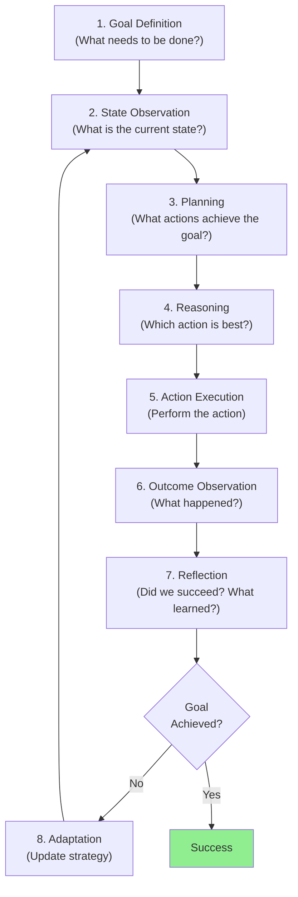
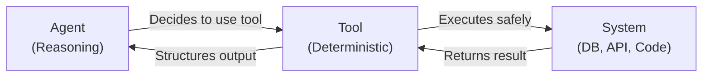
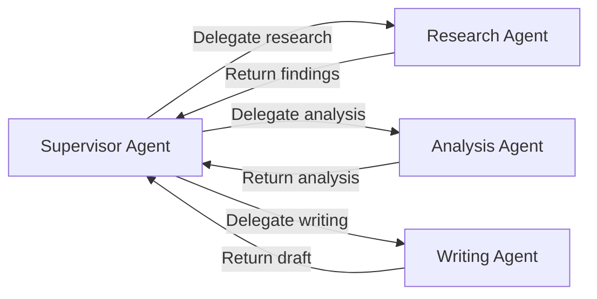

# Chapter 2: Agentic AI Fundamentals

## Chapter Overview

An agent is not just an LLM. An agent is a system—a combination of an LLM, tools, memory, and a decision-making loop—that can perceive its environment, reason about goals, take actions, and learn from outcomes. 

This chapter establishes what agents are, how they differ from traditional software systems and standalone LLMs, and how they form the foundation for building autonomous, goal-directed AI systems. It moves beyond the token-prediction understanding of Chapter 1 to explain how LLMs become intelligent actors within larger systems.

**Core thesis**: Agentic systems represent a fundamental architectural shift. Where traditional software executes predetermined logic and Chapter 1's LLMs perform reasoning, agents combine both—they reason about problems, decide on actions, execute those actions through tools, observe outcomes, and adapt. Understanding the agent lifecycle and its failure points is essential for building production-grade agentic systems.

---

## Learning Objectives

After reading this chapter, you will:

1. **Define agents precisely**: Distinguish agents from LLMs, traditional software, and other AI systems
2. **Understand the agent lifecycle**: Goal → Planning → Action → Observation → Reflection → Adaptation
3. **Identify agent components**: Goal definition, state management, memory systems, reasoning loops, tool integration
4. **Recognize agent patterns**: Reactive, planning-based, hierarchical, multi-agent orchestration
5. **Reason about agent failures**: Hallucinations in planning, tool misuse, memory drift, coordination failure
6. **Design agent supervision strategies**: Human-in-the-loop, approval workflows, guardrails
7. **Architect multi-agent systems**: Supervisor patterns, peer-to-peer coordination, capability-based routing
8. **Evaluate agent frameworks**: LangGraph, CrewAI, AutoGen, Semantic Kernel, Temporal—trade-offs and when to use each

---

## Prerequisites

- Chapter 1: Introduction to Generative AI Foundations (required)
- Understanding of LLM capabilities and limitations
- Familiarity with production systems engineering

---

## 1. What Is an Agent?

### 1.1 Definition

**An agent is an autonomous system that:**
- Has a **goal** or objective
- Perceives its **state** and environment
- Reasons about **actions** to achieve the goal
- **Executes** those actions (through tools, APIs, databases)
- **Observes** outcomes and feedback
- **Reflects** on success/failure
- **Adapts** its strategy based on results

### 1.2 Agent vs LLM

**Critical distinction**:

| Aspect | LLM | Agent |
|--------|-----|-------|
| **Role** | Reasoning engine | Decision-making system |
| **Lifecycle** | Single inference | Multi-step loop |
| **Tools** | None (reads, writes text) | Multiple (APIs, code, databases) |
| **State** | Stateless | Maintains state across steps |
| **Memory** | Context window only | Persistent memory, episodic recall |
| **Feedback** | None (inference ends) | Observes action outcomes |
| **Learning** | Fixed weights (no in-context learning) | Can adapt within execution |
| **Failure handling** | Generates text for any input | Detects and recovers from errors |

**Example**: 
```
LLM asked "Retrieve the customer's last order"
→ Outputs: "The last order is probably..."
→ No way to actually retrieve the order

Agent with goal "Retrieve customer's last order"
→ Decides: "I need to use GetOrderHistory tool"
→ Executes: GetOrderHistory(customer_id=123)
→ Observes: Returns order data
→ Succeeds: Has actual order information
```

### 1.3 Agent vs Traditional Software

**Traditional software**:
```
Input → Deterministic Logic → Output
(Every path is programmed in advance)
```

**Agentic system**:
```
Goal + Environment → Reasoning → Decision → Action → Observation → Adapt
(Path emerges based on reasoning and outcomes)
```

**Key implication**: You cannot enumerate all paths in advance. Agents discover paths through reasoning.

---

## 2. The Agent Lifecycle

Understanding the agent lifecycle is crucial for debugging and designing agents.

### 2.1 The Core Loop



### 2.2 Detailed Breakdown

**Stage 1: Goal Definition**
- User provides objective or system infers it
- Goal is encoded (as text, structured format, or code)
- Goals can be concrete ("Find customer's email") or abstract ("Improve customer satisfaction")

**Stage 2: State Observation**
- Agent observes current state (databases, APIs, user context)
- Builds mental model of environment
- Identifies constraints and resources available

**Stage 3: Planning**
- Agent reasons: "What steps lead to goal achievement?"
- Generates plan (sequence of actions)
- May be explicit (list of steps) or implicit (next action only)

**Stage 4: Reasoning**
- Agent evaluates alternatives
- Selects action most likely to advance toward goal
- Reasoning happens in LLM (token prediction determines next token, which is often tool call)

**Stage 5: Action Execution**
- Agent calls tool, API, or runs code
- Action is deterministic (unlike reasoning)
- Tool returns result or error

**Stage 6: Outcome Observation**
- Agent receives feedback from execution
- Compares result to expectations
- Detects success or failure

**Stage 7: Reflection**
- Agent analyzes: "Did this move us toward the goal?"
- Identifies what worked, what didn't
- Updates mental model

**Stage 8: Adaptation**
- Agent modifies strategy based on reflection
- May change approach, try different tool, adjust parameters
- Returns to Stage 2 (observation) with updated understanding

### 2.3 Loop Termination

Agents can terminate via:

1. **Goal achievement**: Planned outcome reached
2. **Maximum iterations**: Safety limit (prevent infinite loops)
3. **Resource exhaustion**: Out of tokens, API calls, time budget
4. **User intervention**: Human stops agent manually
5. **Error state**: Unrecoverable failure (authorization denied, tool unavailable)

---

## 3. Agent Components

### 3.1 Goal Definition

**What makes a good goal?**

```
✅ GOOD: "Retrieve customer order history, summarize recent orders"
❌ BAD: "Do customer support stuff"

✅ GOOD: "Calculate total revenue for Q4, broken down by region"
❌ BAD: "Analyze data"

✅ GOOD: "Create a support ticket, assign to appropriate team, send confirmation"
❌ BAD: "Handle the issue"
```

**Goal formats**:

| Format | Example | Use Case |
|--------|---------|----------|
| Natural language | "Find top 10 customers by spend" | User-facing agents |
| Structured | `{"action": "report", "metric": "revenue", "period": "Q4"}` | System agents |
| Code | `goal = lambda state: state.goal_achieved()` | Testing, internal agents |

### 3.2 State Management

**State includes**:
- **Current goal** and progress
- **Observations** from environment
- **Tool results** and outcomes
- **Execution history** (what actions were taken)
- **Memory** (relevant past experiences)

**Example state structure**:
```python
{
    "goal": "Find customer's last 5 orders",
    "current_step": 2,
    "customer_id": 123,
    "results": [],
    "execution_history": [
        {"action": "lookup_customer", "result": "customer found"},
        {"action": "get_orders", "result": "5 orders retrieved"}
    ],
    "memory": {
        "customer_tier": "premium",
        "previous_issues": []
    },
    "status": "in_progress"
}
```

### 3.3 Memory Systems

**Working memory** (within single execution):
- Current conversation
- Recent tool outputs
- Current state
- Short-term context (~4K tokens)

**Episodic memory** (across executions):
- Past interactions
- Previous solutions
- Patterns observed
- Error recovery strategies

**Semantic memory** (stable knowledge):
- Company policies
- System configurations
- Domain knowledge
- Operational procedures

**Challenge**: Agents suffer from **memory drift**—over time, memory becomes stale, inconsistent, or grows too large to manage.

### 3.4 Planning and Reasoning

**Explicit planning** (agent creates step-by-step plan):
```
User: "Create quarterly report"
Agent: "Steps:
  1. Query Q4 sales data
  2. Query Q4 expense data
  3. Calculate margins
  4. Format report
  5. Save to file"
Then: Execute each step
```

**Implicit planning** (agent decides next action dynamically):
```
Agent: "I need Q4 data. Let me query sales first."
[Executes query]
Agent: "Now I need expense data..."
[Executes query]
[Continues...]
```

**Trade-offs**:

| Approach | Pros | Cons |
|----------|------|------|
| Explicit planning | Transparent, verifiable, easier to verify | Less adaptive to surprises |
| Implicit planning | Flexible, adapts quickly | Harder to predict, easier to fail |

### 3.5 Tool Integration

**Tools are agent's interface to deterministic systems**:



**Critical principle**: Tools must be **deterministic and safe**.

```python
# ✅ GOOD: Tool validates before executing
def transfer_funds(from_account, to_account, amount):
    if amount <= 0:
        return {"error": "Amount must be positive"}
    if not has_balance(from_account, amount):
        return {"error": "Insufficient funds"}
    execute_transfer(from_account, to_account, amount)
    return {"success": True, "transaction_id": "TXN123"}

# ❌ BAD: Tool executes anything without validation
def execute_sql(query):
    return database.execute(query)  # Can delete all data!
```

**Tool categories**:

| Category | Examples | Risk |
|----------|----------|------|
| Read-only | Database queries, API reads, file reads | Low |
| Modification | Database writes, API calls, file writes | Medium |
| Execution | Code execution, system commands | High |
| Financial | Transfers, purchases, refunds | Critical |

**Rule**: Higher-risk tools require explicit approval before execution.

---

## 4. Agent Patterns and Architectures

### 4.1 Reactive Agents

**Definition**: Agent responds immediately to observations without internal planning.

```
Observation → Reasoning → Action (no explicit planning)
```

**Use case**: Customer support chatbot
```
Customer: "I need to reset my password"
Agent: Observes intent → Decides action: "Send password reset email"
```

**Limitations**:
- Can't handle multi-step tasks
- No lookahead or strategy
- Fails if immediate actions don't solve problem

### 4.2 Planning-Based Agents (Goal-Driven)

**Definition**: Agent creates plan, then executes steps.

```
Goal → Reasoning (planning) → Action sequence → Goal achieved
```

**Example**: Report generation agent
```
Goal: "Create monthly revenue report"
Plan: [Query revenue data] → [Query expense data] → [Calculate margins] → [Format report]
Execute: Each step in sequence
```

**Advantage**: More predictable, verifiable  
**Disadvantage**: Less flexible if environment changes

### 4.3 Hierarchical Agents

**Definition**: Multi-level agent structure (supervisors + workers).

```
Supervisor Agent
├── Retrieval Agent
├── Analysis Agent  
├── Reporting Agent
└── Approval Agent
```

**Pattern**:
- Supervisor decides which worker to delegate to
- Workers specialize in specific tasks
- Supervisor orchestrates workflow

**Example**: Enterprise support system
```
Supervisor: Classifies ticket as urgent/normal
  → If urgent: Delegates to urgent_support_agent
  → If normal: Delegates to standard_support_agent
  → Both report back
  → Supervisor sends response
```

### 4.4 Multi-Agent Orchestration

**Definition**: Multiple specialized agents collaborate toward shared goal.

**Architectures**:



**Peer-to-peer variant** (agents coordinate directly):
```
Agent A ←→ Agent B (negotiate)
Agent B ←→ Agent C (exchange info)
Agent A ←→ Agent C (validate)
→ Reach consensus
```

---

## 5. Agent Failures and Error Handling

### 5.1 Common Failure Modes

**Failure 1: Hallucinated Tool Calls**

Agent decides to call tool that doesn't exist or misunderstands its API.

```
Agent: "I'll use the delete_database() tool"
System: "That tool doesn't exist"
Agent: Fails without recovery
```

**Prevention**: 
- Validate tool calls before execution
- Provide clear tool specifications
- Use tool schemas with strict typing

**Failure 2: Infinite Loops**

Agent repeats same action without progressing toward goal.

```
Agent: "I need customer email"
  → Calls get_customer (returns customer object without email)
  → Calls get_customer again (same result)
  → Calls get_customer again (infinite loop)
```

**Prevention**:
- Track execution history
- Detect repeated actions
- Enforce maximum iteration limit

**Failure 3: Token Exhaustion**

Agent runs out of tokens mid-execution.

```
Agent: Executing with 4K token limit
  → Uses 3.5K tokens for reasoning
  → Only 500 tokens left
  → Can't complete task
  → Fails
```

**Prevention**:
- Token budget per agent execution
- Aggressive summarization
- Chunked processing

**Failure 4: Tool Authorization Failure**

Agent tries to execute action without proper permissions.

```
Agent: "Transfer $10,000"
System: "Not authorized. Only can transfer up to $1,000"
Agent: Fails (should have checked permissions first)
```

**Prevention**:
- Check authorization before tool invocation
- Provide clear permission constraints to agent
- Implement approval workflows

**Failure 5: Memory Drift**

Agent's understanding of state becomes inaccurate over time.

```
Agent: "Customer status is premium" (from memory)
Reality: Customer was downgraded last week
Agent: Makes decision based on stale information
```

**Prevention**:
- Refresh state from authoritative source before decisions
- Timestamp and validate memory
- Periodic memory audit

### 5.2 Error Recovery Strategies

**Strategy 1: Retry with adjustment**
```
Action fails → Modify approach → Retry
```

**Strategy 2: Escalation**
```
Agent can't solve → Escalate to supervisor → Human review
```

**Strategy 3: Fallback action**
```
Primary tool unavailable → Use fallback tool
(e.g., primary: API, fallback: database query)
```

**Strategy 4: Rollback**
```
Action succeeded but caused side effect → Undo action
(e.g., transaction rolled back)
```

---

## 6. Human-in-the-Loop (HITL) Patterns

### 6.1 When Humans Are Required

**High-risk decisions**:
- Financial transactions > threshold
- Personal data modifications
- Irreversible actions
- Policy violations

**Uncertainty**: Agent has low confidence in decision

**Novel situations**: Scenario not seen in training

### 6.2 HITL Implementation Patterns

**Pattern 1: Approval Before Action**
```
Agent decides action → Requests human approval → Human approves/rejects → Execute or abandon
```

**Pattern 2: Oversight After Action**
```
Agent executes → Reports to human → Human audits → Human can rollback if needed
```

**Pattern 3: Escalation**
```
Agent attempts autonomous solution → If uncertain or stuck → Escalates to human → Human provides guidance
```

### 6.3 HITL Challenges

| Challenge | Issue | Solution |
|-----------|-------|----------|
| Latency | Humans slow down agent | Set time limits, if exceeded auto-escalate |
| Cost | Human review expensive | Selective HITL only for high-risk |
| Consistency | Humans make subjective decisions | Provide decision guidelines |
| Attention | Humans miss things in long logs | Highlight critical decisions only |

---

## 7. Agent Communication Protocols

### 7.1 Agent-to-Agent (A2A) Communication

**Challenge**: How do agents coordinate without a single supervisor?

**Approaches**:

**Message-based**:
```
Agent A sends message to Agent B
Agent B processes and responds
Exchange continues until resolution
```

**Capability-based routing**:
```
Agent A needs task X
System: "Agent B specializes in X"
Agent A delegates to Agent B
```

**Contract-based**:
```
Agent A: "I need analysis"
Agent B: "I can provide analysis if you provide data in format X"
Agent A: "I accept. Here's data in format X"
Agent B: "Here's analysis"
```

### 7.2 Model Context Protocol (MCP)

**Purpose**: Standardized way for agents to discover and use tools/resources.

**Flow**:
```
Agent: "What tools are available?"
System: Responds with MCP interface
Agent: "I'll use the database_query tool"
System: Enforces tool contract and limitations
```

**Benefits**:
- Standardized tool discovery
- Enforced safety constraints
- Clear contracts between systems

---

## 8. Agent Governance and Safety

### 8.1 Capability-Based Access Control

**Principle**: Grant agent only capabilities it needs.

```python
# ✅ GOOD: Minimal privileges
agent_tools = [
    "read_customer_data",
    "send_email"
    # Notably: NO database write, no financial tools
]

# ❌ BAD: Excessive privileges
agent_tools = [
    "read_any_data",
    "write_any_data",
    "execute_sql",
    "delete_accounts"
]
```

### 8.2 Audit Logging

**Every agent action must be logged**:

```json
{
  "timestamp": "2024-09-22T14:30:00Z",
  "agent_id": "support-agent-1",
  "goal": "Resolve customer ticket #12345",
  "step": 3,
  "action": "send_email",
  "parameters": {"to": "customer@example.com", "subject": "..."},
  "result": {"status": "success", "message_id": "MSG123"},
  "user": "agent_session_456"
}
```

**Audit enables**:
- Compliance verification
- Incident investigation
- Performance analysis
- Fairness auditing

### 8.3 Guardrails

**Guardrails prevent harmful outputs**:

| Guardrail | Prevents |
|-----------|----------|
| Input validation | Prompt injection, malicious instructions |
| Output filtering | Toxic language, PII leakage, misinformation |
| Rate limiting | Abuse, DOS attacks |
| Token limits | Runaway execution |
| Tool restrictions | Unauthorized access |
| Decision verification | Hallucinated conclusions |

---

## 9. Agent Frameworks

### 9.1 LangGraph

**Purpose**: State graph framework for building agent systems  
**Best for**: Custom agent workflows  

**Strengths**:
- Full control over state and transitions
- Deterministic execution graphs
- Checkpointing and resumption
- Built-in debugging

**Example pattern**:
```
State graph with nodes: [plan, execute, reflect, decide]
Edges define transitions based on outcomes
Checkpoints enable resumption after failures
```

**When to use**: Complex multi-step agents, conditional logic, resumable workflows

### 9.2 CrewAI

**Purpose**: Multi-agent orchestration  
**Best for**: Teams of specialized agents  

**Strengths**:
- Role-based agent definition
- Task-based workflows
- Built-in reporting
- Agent collaboration

**Example**: 
```
Researcher agent (researches topics)
Writer agent (writes reports)
Reviewer agent (reviews content)
Manager agent (coordinates the three)
```

**When to use**: Need multiple specialized agents working together

### 9.3 AutoGen

**Purpose**: Multi-agent conversation framework  
**Best for**: Conversational agent systems  

**Strengths**:
- Agents can have conversations
- Human-in-the-loop integration
- Code execution sandbox
- Flexible orchestration

**When to use**: Agents need to debate decisions, explain reasoning to users

### 9.4 Semantic Kernel

**Purpose**: Agent SDK with plugin architecture  
**Best for**: Microsoft/enterprise environments  

**Strengths**:
- Native .NET support
- Plugin model
- LLM-agnostic (works with multiple LLM providers)
- Enterprise integration

**When to use**: Building agents within enterprise systems, using Microsoft stack

### 9.5 Temporal

**Purpose**: Durable execution engine for workflows  
**Best for**: Long-running, mission-critical agents  

**Strengths**:
- Handles retries, timeouts, failures
- Deterministic replay
- Workflow versioning
- Built for production scale

**When to use**: Long-running agents that must guarantee completion (financial transactions, batch processing)

### 9.6 Framework Comparison

| Framework | Complexity | Multi-agent | Production-ready | Best for |
|-----------|-----------|------------|------------------|----------|
| LangGraph | Medium | Yes | Yes | Custom workflows |
| CrewAI | Low | Yes | Beta | Specialist teams |
| AutoGen | Medium | Yes | Yes | Conversation-based |
| Semantic Kernel | Medium | Partial | Yes | Enterprise .NET |
| Temporal | High | Limited | Yes | Mission-critical |

---

## 10. Agent Interview Questions

### Question 1: What distinguishes an agent from a standalone LLM?

**Expected answer**:
- Agents have a goal and seek to achieve it
- Agents use tools to interact with systems
- Agents observe outcomes and adapt
- Agents maintain state across multiple steps
- LLMs are stateless reasoning engines; agents are goal-seeking systems

**Example answer**:
"An LLM is a token prediction machine that generates text. An agent is a system that uses an LLM for reasoning, but wraps it with tools, state management, and a reasoning loop. The agent has a goal, reasons about actions to achieve it, executes those actions through tools, observes what happened, and adapts its strategy. This is fundamentally different from an LLM which just generates text once and stops."

---

### Question 2: Walk through the agent lifecycle with a concrete example.

**Expected answer**:
- Goal definition (what needs to be done)
- State observation (what's the current situation)
- Planning (what actions achieve the goal)
- Execution (actually perform actions)
- Observation (what was the result)
- Reflection (did it work)
- Adaptation (adjust strategy if needed)

**Example**: Customer support agent resolving billing dispute
```
1. Goal: "Resolve customer's billing dispute"
2. Observe: Customer account, recent charges, complaint details
3. Plan: "Check transaction history, identify error, issue refund if valid"
4. Execute: Query transaction DB
5. Observe: Found duplicate charge from 9/20
6. Reflect: "This is clearly an error. Customer is right."
7. Adapt: "Proceed with refund + apology"
8. Execute: Issue $50 refund
```

---

### Question 3: How would you prevent an agent from entering an infinite loop?

**Expected answer**:
- Track execution history
- Detect repeated actions without progress
- Implement maximum iteration limit
- Provide agent with "self-awareness" about progress

**Example implementation**:
```python
iterations = 0
max_iterations = 10
last_action = None

while not goal_achieved and iterations < max_iterations:
    action = agent.decide_next_action()
    if action == last_action:  # Repeated action
        raise Exception("Infinite loop detected")
    execute_action(action)
    last_action = action
    iterations += 1

if iterations == max_iterations:
    escalate_to_human()
```

---

### Question 4: Design an approval workflow for an agent that transfers money.

**Expected answer**:
- Define approval thresholds (e.g., > $1,000 needs approval)
- Agent can't execute transfer directly
- Agent must submit for approval
- Human reviews and approves/rejects
- Only after approval does transfer execute
- Audit log everything

**Example workflow**:
```
Agent: "I need to transfer $5,000"
System: "This exceeds threshold. Requesting approval."
Human: Reviews agent's reasoning and request
Human: "Approved" or "Rejected"
If approved: Transfer executes
If rejected: Agent tries alternate approach
```

---

### Question 5: How would you handle an agent that's uncertain about its decision?

**Expected answer**:
- Quantify confidence (e.g., 0.0-1.0)
- If confidence < threshold, escalate
- Request human guidance
- Or seek additional information before deciding

**Implementation**:
```python
decision, confidence = agent.make_decision()
if confidence < 0.7:
    human_decision = escalate_to_human(
        decision=decision,
        reasoning=agent.explain_reasoning(),
        confidence=confidence
    )
else:
    execute_decision(decision)
```

---

### Question 6: Describe the trade-offs between reactive and planning-based agents.

**Expected answer**:

| Aspect | Reactive | Planning-based |
|--------|----------|---|
| Response time | Fast | Slower |
| Adaptability | High | Lower |
| Predictability | Low | High |
| Best for | Simple, immediate tasks | Complex, multi-step goals |
| Failure modes | Immediate failures visible | Failures detected after planning |

---

## 11. Agent Design Checklist

Every agent system should address:

### Goal and Objectives
- [ ] Goal is clearly defined and measurable
- [ ] Success criteria are explicit
- [ ] Failure conditions identified
- [ ] Goal alignment with business objectives

### State Management
- [ ] State structure defined
- [ ] State is validated before decisions
- [ ] State updated after each action
- [ ] State persisted for resumption

### Memory
- [ ] Working memory limits set
- [ ] Episodic memory retention policy defined
- [ ] Memory staleness detection implemented
- [ ] Memory refresh strategy specified

### Tool Integration
- [ ] Tools validated before execution
- [ ] Tool error handling specified
- [ ] Tool results verified
- [ ] Fallback tools identified

### Reasoning and Planning
- [ ] Reasoning model documented
- [ ] Planning strategy (explicit vs implicit) chosen
- [ ] Plan verification implemented
- [ ] Reasoning constraints specified

### Execution and Observation
- [ ] Action execution is deterministic
- [ ] Outcomes are observable
- [ ] Failures are detectable
- [ ] Feedback is actionable

### Error Handling
- [ ] Error types identified
- [ ] Recovery strategies defined
- [ ] Escalation criteria specified
- [ ] Rollback capabilities exist

### Governance
- [ ] Tool authorization defined
- [ ] Capability restrictions enforced
- [ ] Audit logging implemented
- [ ] HITL triggers defined

### Observability
- [ ] Execution traces logged
- [ ] Decision points instrumented
- [ ] Performance metrics tracked
- [ ] Error rates monitored

### Evaluation
- [ ] Success metrics defined
- [ ] Baseline established
- [ ] Regression tests automated
- [ ] Production monitoring linked to eval

---

## 12. Key Takeaways

1. **Agents are goal-seeking systems**: Not just LLMs that talk, but systems that reason, act, observe, and adapt.

2. **The agent lifecycle is crucial**: Goal → Observe → Plan → Reason → Execute → Observe → Reflect → Adapt. Understanding each stage reveals failure modes.

3. **State and memory management are hard**: Agents must track state accurately and manage memory efficiently. This is often where systems fail.

4. **Tools are agent's interface to reality**: Tools must be deterministic, safe, and validated. Agents can hallucinate tool calls; validation is non-negotiable.

5. **Explicit planning vs implicit planning**: Each has trade-offs. Explicit plans are verifiable but inflexible; implicit plans adapt but are harder to reason about.

6. **Human-in-the-loop is necessary**: Not just for UX, but for safety. High-risk decisions require human oversight.

7. **Multi-agent systems need orchestration**: Whether via supervisor pattern or peer coordination, agents need clear protocols for working together.

8. **Governance precedes capability**: Design guardrails before building agents. Easier to prevent harm than to recover from it.

9. **Observability is essential**: You can't improve what you can't measure. Instrument agents heavily.

10. **Agent frameworks are tools, not solutions**: LangGraph, CrewAI, AutoGen, Temporal each solve different problems. Choose based on your constraints.

---

## 13. References and Further Reading

**Agent Theory**:
- Russell & Norvig: "Artificial Intelligence: A Modern Approach" (Chapter on Agents)
- Wooldridge & Jennings: "Intelligent Agents: Theory and Practice"

**Production Agents**:
- LangGraph Documentation: langgraph.dev
- CrewAI: crewai.com
- AutoGen: microsoft/autogen

**Multi-Agent Systems**:
- Shoham & Leyton-Brown: "Multiagent Systems"
- Papers: "Towards Cooperative Multi-Agent Reinforcement Learning"

**Next Steps**:
- Chapter 3: Agent Design Principles
- Chapter 4: ReAct Pattern (agent reasoning and acting)
- Chapter 11: Supervisor Pattern (multi-agent orchestration)

---

## Chapter Appendix: Quick Reference

**Agent Lifecycle Summary**:
1. Define goal
2. Observe state
3. Plan actions
4. Reason about best action
5. Execute action
6. Observe outcome
7. Reflect on result
8. Adapt strategy (repeat from step 2)

**Failure Modes Checklist**:
- [ ] Hallucinated tool calls?
- [ ] Infinite loops?
- [ ] Token exhaustion?
- [ ] Authorization failures?
- [ ] Memory drift?

**Framework Selection Guide**:
- Custom workflow? → LangGraph
- Multi-agent team? → CrewAI
- Conversational agents? → AutoGen
- Enterprise .NET? → Semantic Kernel
- Mission-critical? → Temporal

**Key Metrics**:
- Goal achievement rate
- Average steps to goal
- Tool accuracy
- Error recovery rate
- Human escalation rate
